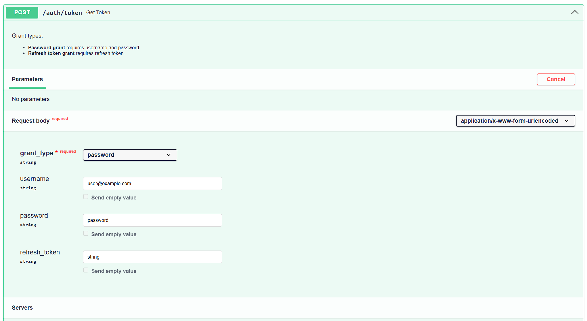
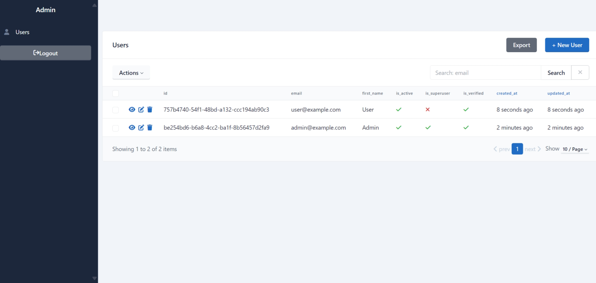

# FastAPI Template

Production-ready FastAPI template with PostgreSQL, Redis & JWT authorization.

## Features

- Secure and usable **JWT authorization** (feat. Refresh Tokens)
- Confirm actions using an email **one-time code**
- Extendable **role-based access control** (supports user & superuser)
- Powerful **user** management: CRUD, search, etc.
- **Admin panel** with authorization & CRUD operations
- **Docker**, **Pre-commit** & **CI** for better development experience
- Built with **[FastAPI best practices](https://github.com/zhanymkanov/fastapi-best-practices)**
  and **[Tips](https://github.com/Kludex/fastapi-tips)**

## Installation

1. Clone the repository:

```bash
git clone https://github.com/everysoftware/fastapi-template
```

2. Generate RSA keys:

```bash
openssl genrsa -out certs/private.pem 2048
openssl rsa -in certs/private.pem -pubout -out certs/public.pem
```

3. Create a `.env` file. Use the `.env.example` as a reference.
4. Run the application:

```bash
make up
```

## Screenshots





**Made with love ❤️**
